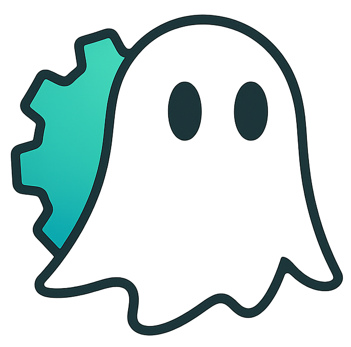

# Poltergeist 👻 — The ghost that keeps your builds fresh

<p align="center">
  
</p>

[](https://github.com/steipete/poltergeist/actions/workflows/ci.yml)
[](https://registry.npmjs.org/@steipete%2Fpoltergeist/latest)
[](https://nodejs.org/)
[](https://github.com/steipete/poltergeist/actions/workflows/ci.yml)
[](LICENSE)
[](https://github.com/steipete/homebrew-tap)

Poltergeist watches a project, rebuilds affected targets after source changes, and records whether each artifact is fresh. It is for developers and coding agents that need one build loop across native apps, command-line tools, tests, containers, and mixed-language workspaces.

```sh
poltergeist haunt
polter my-app
```

The daemon handles builds in the background; `polter` waits for a successful build before it runs an executable target.

## Install

### Homebrew

On macOS, the standalone build needs neither Node.js nor a separate Watchman install:

```sh
brew install steipete/tap/poltergeist
```

### npm

On macOS, Linux, or Windows, install the package with Node.js 24 or newer:

```sh
npm install --global @steipete/poltergeist
```

The npm package also requires [Watchman](https://facebook.github.io/watchman/):

- macOS: `brew install watchman`
- Linux: follow the [Watchman install guide](https://facebook.github.io/watchman/docs/install#linux)
- Windows: use the [Watchman Windows instructions](https://facebook.github.io/watchman/docs/install#windows)

Check both tools before continuing:

```sh
poltergeist --version
watchman --version
```

## Quick start

Run these commands from a project root:

```sh
poltergeist init --auto
poltergeist list
poltergeist haunt
poltergeist status
polter <executable-target> [args...]
```

`init --auto` recognizes Swift, Node.js, Rust, Python, CMake, Make, and Go projects. Review the generated `poltergeist.config.json`; in particular, confirm each target's build command, watched paths, and output path. `polter` only launches executable targets, while `poltergeist build <target>` can trigger any configured target manually.

Stop the project daemon with `poltergeist stop`.

## The build loop

Each project has its own daemon. Watchman reports file changes, Poltergeist matches them to targets, coalesces noisy saves, and queues the required builds. Per-target state and logs let the CLI, status panel, macOS companion, and other processes observe the same result without sharing a daemon.

Targets can represent executables, app bundles, libraries, frameworks, tests, Docker images, npm scripts, custom commands, and CMake targets. A target defines what to watch and how to build; executable targets also identify the artifact that `polter` launches.

See the [CLI and configuration guide](docs/cli.md) for manual configuration, command workflows, hot reload, and automation output. The [`examples/`](examples/) directory contains configurations for several build systems.

## Status and control

Use the regular status commands in scripts or terminals:

| Command | Purpose |
| --- | --- |
| `poltergeist status` | Show daemon and build state |
| `poltergeist logs [target]` | Read or follow build logs |
| `poltergeist wait [target]` | Wait for an active build |
| `poltergeist build [target]` | Trigger a build manually |
| `poltergeist pause` / `resume` | Suspend or resume automatic builds |
| `poltergeist panel` | Open the interactive terminal dashboard |

The [panel guide](docs/panel.md) covers its target list, log views, git summaries, status scripts, and keybindings. Pause behavior is documented in [pause and resume controls](docs/pause-resume.md).

A signed menu bar companion for macOS 15 or newer is attached to the [latest GitHub release](https://github.com/steipete/poltergeist/releases/latest). It monitors the same project state; see the [macOS app guide](apps/mac/README.md).

## Hot reload

For an executable that should restart after successful builds, either run `polter <target> --watch` or configure the target's `autoRun` settings. App bundles, servers, and deployment targets can use build commands and post-build hooks for their own relaunch or deploy step.

The [hot-reload guide](docs/cli.md#hot-reload) shows both approaches and the relevant settling, debounce, environment, and restart controls.

## Development

Node.js 24 and pnpm 11 are required for CLI development.

```sh
pnpm install
pnpm run build
pnpm run lint
pnpm run typecheck
pnpm test
```

See [CONTRIBUTING.md](CONTRIBUTING.md) for the repository layout and macOS app workflow.

## Community and credits

Read [the story behind Poltergeist](https://steipete.me/posts/2025/poltergeist-ghost-keeps-builds-fresh), and use [GitHub Issues](https://github.com/steipete/poltergeist/issues) for bugs, questions, and ideas.

Poltergeist is maintained by [Peter Steinberger](https://github.com/steipete). It builds on [Watchman](https://facebook.github.io/watchman/) and the Node.js open-source ecosystem; thanks to every contributor and user who has helped shape it.

## License

[MIT](LICENSE).
