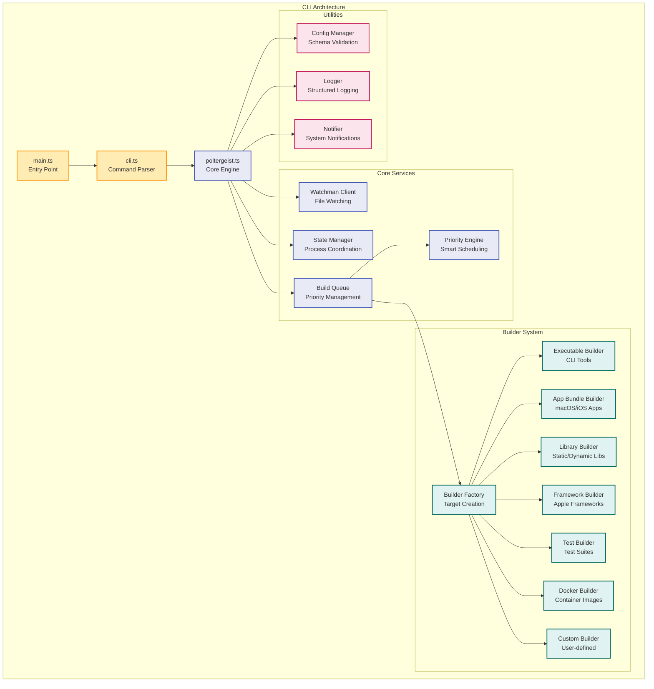
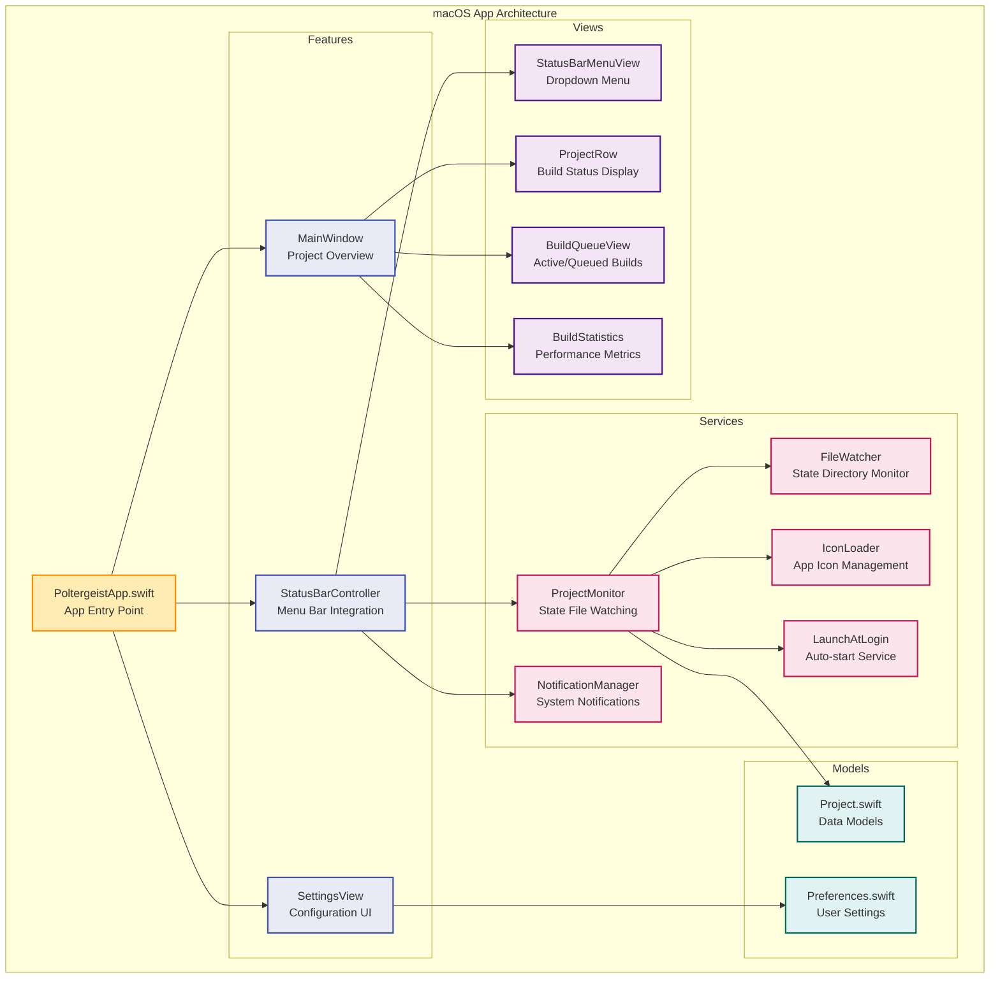
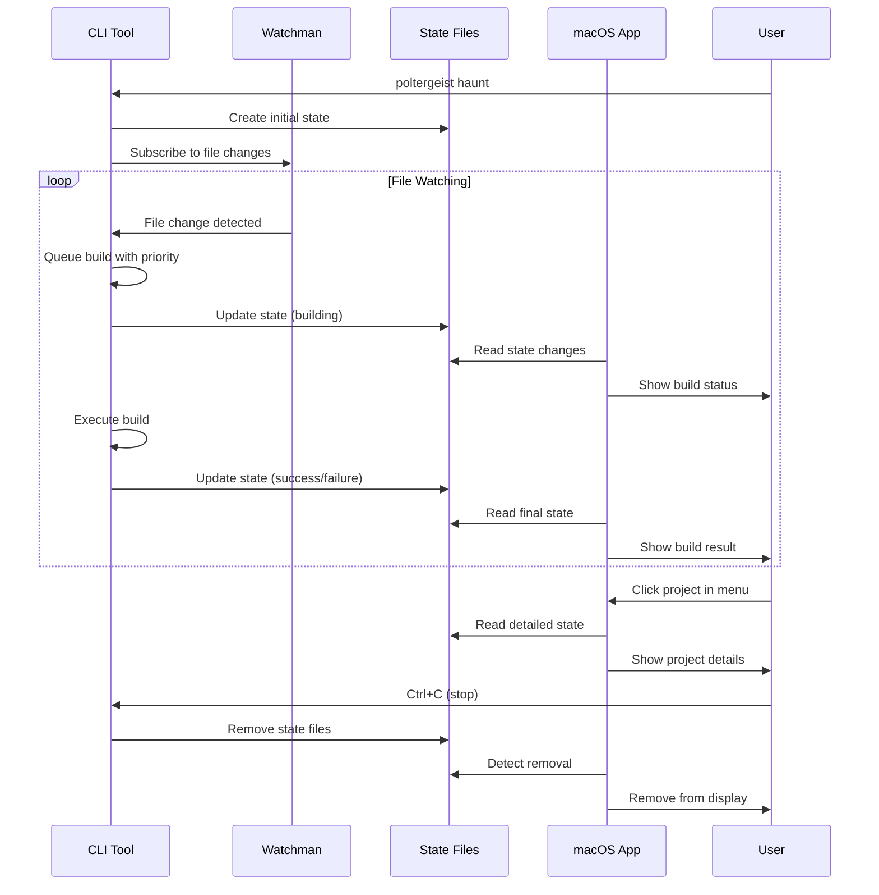

# Poltergeist Architecture

This document provides a comprehensive overview of Poltergeist's architecture, showing how the CLI and macOS components work together to provide seamless file watching and build automation.

## Overview

Poltergeist is a dual-platform application consisting of:
- **CLI Tool** (Node.js/TypeScript) - Core file watching and build engine
- **macOS App** (Swift/SwiftUI) - Native GUI for monitoring and control

Both components communicate through shared state files and configuration, providing a unified experience across command-line and GUI interfaces.

## High-Level Architecture

```mermaid
graph TB
    subgraph "User Interfaces"
        CLI[CLI Tool<br/>Node.js/TypeScript]
        MAC[macOS App<br/>Swift/SwiftUI]
    end
    
    subgraph "Core Services"
        WATCHMAN[Watchman<br/>File Watching Service]
        STATE[State Management<br/>JSON State Files]
        CONFIG[Configuration<br/>poltergeist.config.json]
    end
    
    subgraph "Build System"
        QUEUE[Build Queue<br/>Priority Engine]
        BUILDERS[Builder Factory<br/>Target-specific Builders]
        NOTIFIER[Notification System<br/>macOS Notifications]
    end
    
    subgraph "File System"
        TMPDIR[/tmp/poltergeist/<br/>State Files]
        PROJECT[Project Root<br/>Config & Source Files]
    end
    
    CLI --> WATCHMAN
    CLI --> STATE
    CLI --> CONFIG
    CLI --> QUEUE
    
    MAC --> STATE
    MAC --> CONFIG
    MAC --> NOTIFIER
    
    WATCHMAN --> QUEUE
    QUEUE --> BUILDERS
    BUILDERS --> STATE
    BUILDERS --> NOTIFIER
    
    STATE --> TMPDIR
    CONFIG --> PROJECT
    
    classDef interface fill:#e1f5fe,stroke:#01579b,stroke-width:2px
    classDef service fill:#f3e5f5,stroke:#4a148c,stroke-width:2px  
    classDef storage fill:#e8f5e8,stroke:#1b5e20,stroke-width:2px
    
    class CLI,MAC interface
    class WATCHMAN,QUEUE,BUILDERS,NOTIFIER service
    class STATE,CONFIG,TMPDIR,PROJECT storage
```

## Component Architecture

### CLI Tool (Node.js/TypeScript)

The CLI tool serves as the core engine for file watching and build orchestration:



### macOS App (Swift/SwiftUI)

The macOS app provides a native GUI for monitoring and controlling Poltergeist instances:



## Data Flow and Communication

### State Management Flow



### Build Priority Flow

```mermaid
graph LR
    subgraph "File Change Detection"
        FILE_CHANGE[File Change<br/>Detected by Watchman]
        CLASSIFY[Classify Change<br/>Direct/Shared/Generated]
        IMPACT[Calculate Impact<br/>Weight and Scope]
    end
    
    subgraph "Priority Calculation"
        FOCUS[Focus Detection<br/>Recent Activity]
        HISTORY[Build History<br/>Success Rate & Time]
        PRIORITY[Priority Score<br/>Algorithm]
    end
    
    subgraph "Build Scheduling"
        QUEUE[Build Queue<br/>Priority Ordered]
        PARALLEL[Parallel Execution<br/>Concurrency Control]
        TIMEOUT[Dynamic Timeout<br/>Based on History]
    end
    
    FILE_CHANGE --> CLASSIFY
    CLASSIFY --> IMPACT
    IMPACT --> FOCUS
    FOCUS --> HISTORY
    HISTORY --> PRIORITY
    PRIORITY --> QUEUE
    QUEUE --> PARALLEL
    PARALLEL --> TIMEOUT
    
    classDef detection fill:#e3f2fd,stroke:#1976d2,stroke-width:2px
    classDef priority fill:#f1f8e9,stroke:#388e3c,stroke-width:2px
    classDef scheduling fill:#fef7ff,stroke:#7b1fa2,stroke-width:2px
    
    class FILE_CHANGE,CLASSIFY,IMPACT detection
    class FOCUS,HISTORY,PRIORITY priority
    class QUEUE,PARALLEL,TIMEOUT scheduling
```



## Configuration and Interoperability

### Configuration Schema

Both CLI and macOS app use the same configuration schema (`poltergeist.config.json`):

```typescript
interface PoltergeistConfig {
  version: '1.0';
  projectType: 'swift' | 'node' | 'rust' | 'python' | 'mixed';
  targets: Target[];
  watchman: WatchmanConfig;
  performance?: PerformanceConfig;
  buildScheduling?: BuildSchedulingConfig;
  notifications?: NotificationConfig;
  logging?: LoggingConfig;
}
```

### State File Format

Communication between CLI and macOS app happens via JSON state files:

```typescript
interface PoltergeistState {
  version: string;
  projectPath: string;
  projectName: string;
  target: string;
  configPath: string;
  process: ProcessInfo;
  lastBuild: BuildStatus;
  appInfo: AppInfo;
}
```

## Key Design Principles

### 1. **Separation of Concerns**
- CLI handles file watching and build execution
- macOS app focuses on monitoring and user interaction
- Clean interfaces through state files and configuration

### 2. **Cross-Platform Compatibility**
- TypeScript CLI runs on any Node.js environment
- macOS app provides native experience
- Shared configuration format ensures consistency

### 3. **Performance Optimization**
- Intelligent build prioritization based on user activity
- Efficient file watching with Watchman
- Concurrent build execution with smart queuing

### 4. **Extensibility**
- Plugin-based builder system
- Configurable target types
- Custom build commands and environments

### 5. **User Experience**
- Real-time build status updates
- Native macOS notifications
- Minimal configuration required

## Security Considerations

### File System Access
- State files stored in `/tmp/poltergeist/` for ephemeral data
- Configuration files remain in project root
- No global system modifications required

### Process Isolation
- Each project instance runs independently
- Heartbeat mechanism prevents zombie processes
- Clean shutdown removes all state files

### macOS Integration
- Sandboxed app bundle (when distributed via App Store)
- Uses standard macOS notification center
- Follows Apple's security guidelines

This architecture ensures Poltergeist provides a robust, performant, and user-friendly development experience across both command-line and graphical interfaces.